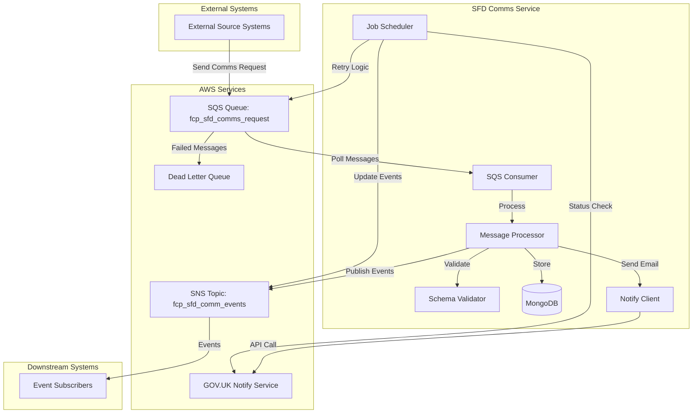
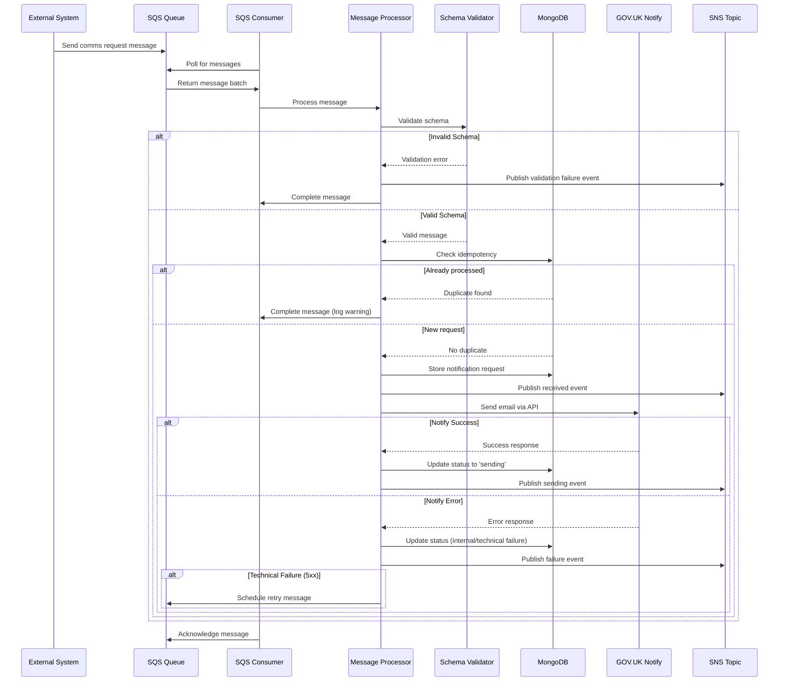
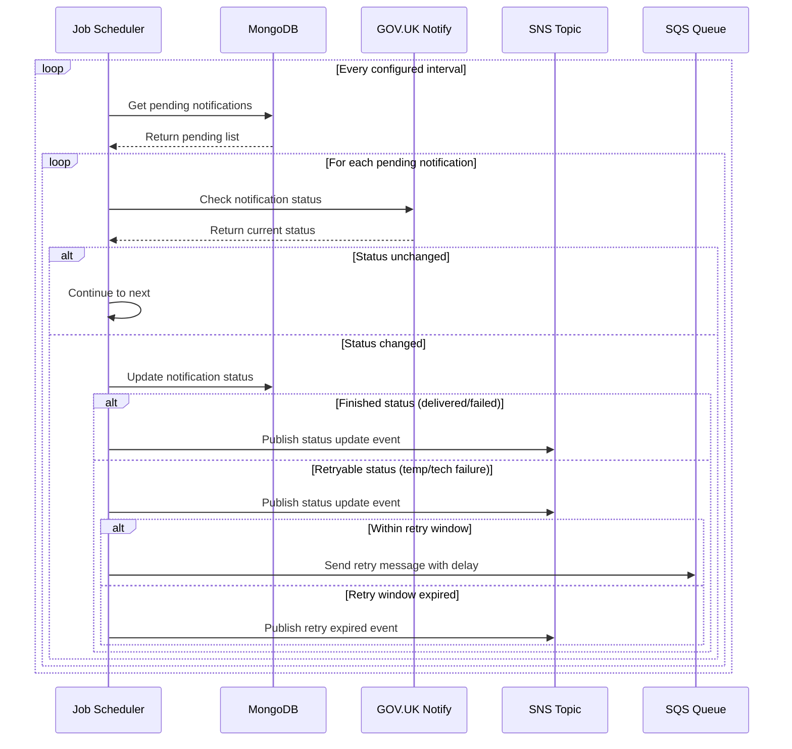
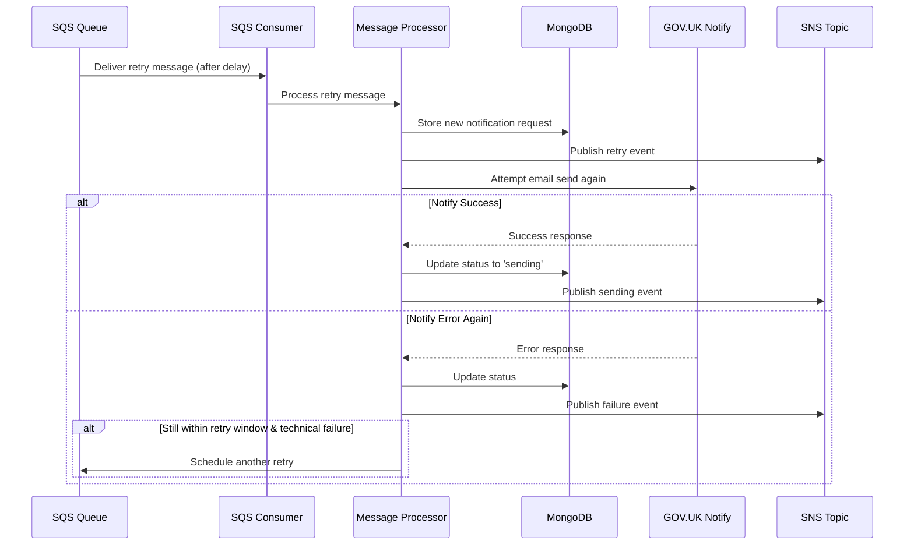
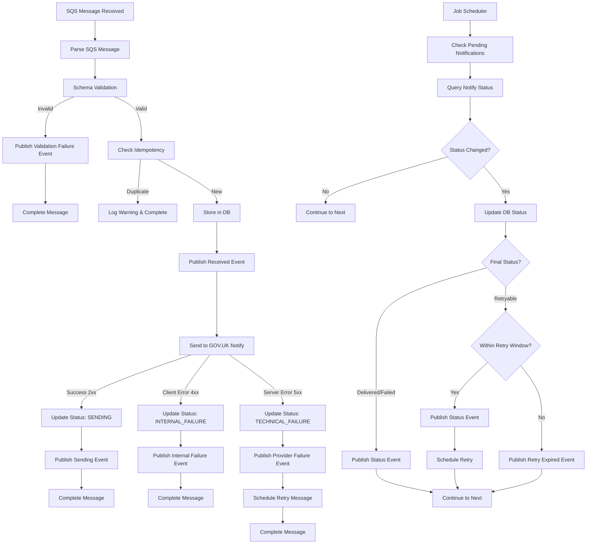

# FCP SFD Communications Service - Lifecycle Analysis

## Overview

The FCP SFD Communications service processes communication requests through a robust messaging pipeline using AWS SQS for input and SNS for event publishing. This document provides a comprehensive analysis of the communication request lifecycle, possible paths, and event flows.

## Architecture Overview



## Message Flow Diagrams

### 1. New Communication Request Flow



### 2. Status Monitoring and Retry Flow



### 3. Retry Message Processing Flow



## Event Types and Paths

### Input Events (SQS)

#### 1. New Communication Request
```json
{
  "id": "79389915-7275-457a-b8ca-8bf206b2e67b",
  "source": "ffc-ahwr-application",
  "specversion": "1.0",
  "type": "uk.gov.fcp.sfd.notification.request",
  "datacontenttype": "application/json",
  "time": "2023-10-17T14:48:00.000Z",
  "data": {
    "crn": 1234567890,
    "sbi": 123456789,
    "sourceSystem": "ffc-ahwr",
    "notifyTemplateId": "f33517ff-2a88-4f6e-b855-c550268ce08a",
    "commsType": "email",
    "recipient": "farmer@example.com",
    "personalisation": {
      "caseNumber": "ACC123456789",
      "expectedPaymentDate": "21.11.2025",
      "adminName": "Jessica Lrrr"
    },
    "reference": "ffc-ahwr-reference-123",
    "oneClickUnsubscribeUrl": "https://unsubscribe.example.com",
    "emailReplyToId": "8e222534-7f05-4972-86e3-17c5d9f894e2"
  }
}
```

#### 2. Retry Communication Request
```json
{
  "id": "a4ea0d13-ea7f-4f5b-9c4c-ce34ec2cbabf",
  "source": "ffc-ahwr-application",
  "specversion": "1.0",
  "type": "uk.gov.fcp.sfd.notification.retry",
  "datacontenttype": "application/json",
  "time": "2023-10-17T15:03:00.000Z",
  "data": {
    "correlationId": "79389915-7275-457a-b8ca-8bf206b2e67b",
    "crn": 1234567890,
    "sbi": 123456789,
    "sourceSystem": "ffc-ahwr",
    "notifyTemplateId": "f33517ff-2a88-4f6e-b855-c550268ce08a",
    "commsType": "email",
    "recipient": "farmer@example.com",
    "personalisation": {
      "caseNumber": "ACC123456789",
      "expectedPaymentDate": "21.11.2025",
      "adminName": "Jessica Lrrr"
    },
    "reference": "ffc-ahwr-reference-123",
    "oneClickUnsubscribeUrl": "https://unsubscribe.example.com",
    "emailReplyToId": "8e222534-7f05-4972-86e3-17c5d9f894e2"
  }
}
```

### Output Events (SNS)

#### 1. Request Received Event
```json
{
  "id": "550e8400-e29b-41d4-a716-446655440001",
  "source": "fcp-sfd-comms",
  "specversion": "1.0",
  "type": "uk.gov.fcp.sfd.notification.received",
  "datacontenttype": "application/json",
  "time": "2023-10-17T14:48:01.000Z",
  "data": {
    "correlationId": "79389915-7275-457a-b8ca-8bf206b2e67b",
    "crn": 1234567890,
    "sbi": 123456789,
    "sourceSystem": "ffc-ahwr",
    "notifyTemplateId": "f33517ff-2a88-4f6e-b855-c550268ce08a",
    "commsType": "email",
    "recipient": "farmer@example.com",
    "personalisation": {
      "caseNumber": "ACC123456789",
      "expectedPaymentDate": "21.11.2025",
      "adminName": "Jessica Lrrr"
    },
    "reference": "ffc-ahwr-reference-123",
    "oneClickUnsubscribeUrl": "https://unsubscribe.example.com",
    "emailReplyToId": "8e222534-7f05-4972-86e3-17c5d9f894e2"
  }
}
```

#### 2. Validation Failure Event
```json
{
  "id": "550e8400-e29b-41d4-a716-446655440002",
  "source": "fcp-sfd-comms",
  "specversion": "1.0",
  "type": "uk.gov.fcp.sfd.notification.failure.validation",
  "datacontenttype": "application/json",
  "time": "2023-10-17T14:48:01.000Z",
  "data": {
    "correlationId": "79389915-7275-457a-b8ca-8bf206b2e67b",
    "recipient": "invalid-email",
    "statusDetails": {
      "status": "validation-failure",
      "errors": [
        {
          "error": "ValidationError",
          "message": "\"data.recipient\" must be a valid email"
        }
      ]
    }
  }
}
```

#### 3. Sending Status Event
```json
{
  "id": "550e8400-e29b-41d4-a716-446655440003",
  "source": "fcp-sfd-comms",
  "specversion": "1.0",
  "type": "uk.gov.fcp.sfd.notification.sending",
  "datacontenttype": "application/json",
  "time": "2023-10-17T14:48:02.000Z",
  "data": {
    "correlationId": "79389915-7275-457a-b8ca-8bf206b2e67b",
    "recipient": "farmer@example.com",
    "statusDetails": {
      "status": "sending"
    }
  }
}
```

#### 4. Delivered Status Event
```json
{
  "id": "550e8400-e29b-41d4-a716-446655440004",
  "source": "fcp-sfd-comms",
  "specversion": "1.0",
  "type": "uk.gov.fcp.sfd.notification.delivered",
  "datacontenttype": "application/json",
  "time": "2023-10-17T14:50:00.000Z",
  "data": {
    "correlationId": "79389915-7275-457a-b8ca-8bf206b2e67b",
    "recipient": "farmer@example.com",
    "statusDetails": {
      "status": "delivered"
    }
  }
}
```

#### 5. Provider Failure Event
```json
{
  "id": "550e8400-e29b-41d4-a716-446655440005",
  "source": "fcp-sfd-comms",
  "specversion": "1.0",
  "type": "uk.gov.fcp.sfd.notification.failure.provider",
  "datacontenttype": "application/json",
  "time": "2023-10-17T14:48:05.000Z",
  "data": {
    "correlationId": "79389915-7275-457a-b8ca-8bf206b2e67b",
    "recipient": "farmer@example.com",
    "statusDetails": {
      "status": "permanent-failure"
    }
  }
}
```

#### 6. Internal Failure Event
```json
{
  "id": "550e8400-e29b-41d4-a716-446655440006",
  "source": "fcp-sfd-comms",
  "specversion": "1.0",
  "type": "uk.gov.fcp.sfd.notification.failure.internal",
  "datacontenttype": "application/json",
  "time": "2023-10-17T14:48:02.000Z",
  "data": {
    "correlationId": "79389915-7275-457a-b8ca-8bf206b2e67b",
    "recipient": "farmer@example.com",
    "statusDetails": {
      "status": "internal-failure",
      "errorCode": 400,
      "errors": [
        {
          "error": "BadRequestError",
          "message": "Missing personalisation key: 'caseNumber'"
        }
      ]
    }
  }
}
```

#### 7. Retry Event
```json
{
  "id": "550e8400-e29b-41d4-a716-446655440007",
  "source": "fcp-sfd-comms",
  "specversion": "1.0",
  "type": "uk.gov.fcp.sfd.notification.retry",
  "datacontenttype": "application/json",
  "time": "2023-10-17T15:03:00.000Z",
  "data": {
    "correlationId": "79389915-7275-457a-b8ca-8bf206b2e67b",
    "crn": 1234567890,
    "sbi": 123456789,
    "sourceSystem": "ffc-ahwr",
    "notifyTemplateId": "f33517ff-2a88-4f6e-b855-c550268ce08a",
    "commsType": "email",
    "recipient": "farmer@example.com",
    "personalisation": {
      "caseNumber": "ACC123456789",
      "expectedPaymentDate": "21.11.2025",
      "adminName": "Jessica Lrrr"
    },
    "reference": "ffc-ahwr-reference-123",
    "oneClickUnsubscribeUrl": "https://unsubscribe.example.com",
    "emailReplyToId": "8e222534-7f05-4972-86e3-17c5d9f894e2"
  }
}
```

#### 8. Retry Expired Event
```json
{
  "id": "550e8400-e29b-41d4-a716-446655440008",
  "source": "fcp-sfd-comms",
  "specversion": "1.0",
  "type": "uk.gov.fcp.sfd.notification.retry.expired",
  "datacontenttype": "application/json",
  "time": "2023-10-24T14:48:00.000Z",
  "data": {
    "correlationId": "79389915-7275-457a-b8ca-8bf206b2e67b",
    "recipient": "farmer@example.com"
  }
}
```

## Processing Paths and Decision Tree



## Status Mappings

### Notify Statuses to Event Types
| Notify Status | Event Type | Description |
|--------------|------------|-------------|
| `created` | `uk.gov.fcp.sfd.notification.sending` | Notification created in Notify |
| `sending` | `uk.gov.fcp.sfd.notification.sending` | Notification being sent |
| `delivered` | `uk.gov.fcp.sfd.notification.delivered` | Successfully delivered |
| `permanent-failure` | `uk.gov.fcp.sfd.notification.failure.provider` | Permanent delivery failure |
| `temporary-failure` | `uk.gov.fcp.sfd.notification.failure.provider` | Temporary failure (retryable) |
| `technical-failure` | `uk.gov.fcp.sfd.notification.failure.provider` | Technical failure (retryable) |
| `internal-failure` | `uk.gov.fcp.sfd.notification.failure.internal` | Service internal failure |
| `validation-failure` | `uk.gov.fcp.sfd.notification.failure.validation` | Invalid request data |

### Retry Logic
- **Retryable Statuses**: `temporary-failure`, `technical-failure`
- **Retry Window**: 168 hours (7 days) from original request
- **Retry Delay**: 15 minutes between attempts
- **Finished Statuses**: `delivered`, `permanent-failure`, `temporary-failure`, `technical-failure`, `internal-failure`

## Key Components

### 1. SQS Consumer (`src/messaging/inbound/comms-request/consumer.js`)
- Polls SQS queue for new messages
- Handles batch processing
- Manages error handling and logging

### 2. Message Handler (`src/messaging/inbound/comms-request/handler.js`)
- Parses SQS messages
- Routes to appropriate processor
- Ensures message completion

### 3. V1 Processor (`src/messaging/inbound/comms-request/processors/v1/v1.js`)
- Validates message schema
- Manages idempotency checks
- Orchestrates Notify integration
- Handles success/error paths

### 4. Notify Integration (`src/messaging/inbound/comms-request/notify-service/`)
- Sends emails via GOV.UK Notify
- Handles API responses and errors
- Manages retry logic for technical failures

### 5. Status Monitoring (`src/jobs/check-notify-status/`)
- Periodic job to check notification statuses
- Updates database with current status
- Triggers retry or expiry logic

### 6. Event Publishers (`src/messaging/outbound/`)
- Publishes events to SNS topic
- Handles different event types
- Manages error scenarios

## Error Handling

### Validation Errors
- Invalid schema triggers validation failure event
- Message is completed (not retried)
- Error details included in event

### Notify API Errors
- **4xx errors**: Treated as internal failures (not retried)
- **5xx errors**: Treated as technical failures (retried)
- Network errors: Service throws exception

### Retry Strategy
- Technical failures trigger automatic retry
- 15-minute delay between retry attempts
- 7-day retry window from original request
- Retry expired event published when window closes

## Monitoring and Observability

### Logs
- Message processing success/failure
- Notify API responses
- Retry scheduling and expiry
- Error details with correlation IDs

### Events
- All state changes published to SNS
- Correlation IDs for tracking
- Status details with error information
- Timestamps for audit trail

### Database
- Idempotency tracking
- Status history
- Correlation mapping for retries
- Audit trail with timestamps

This architecture ensures reliable message delivery with comprehensive error handling, retry mechanisms, and full observability of the communication lifecycle.